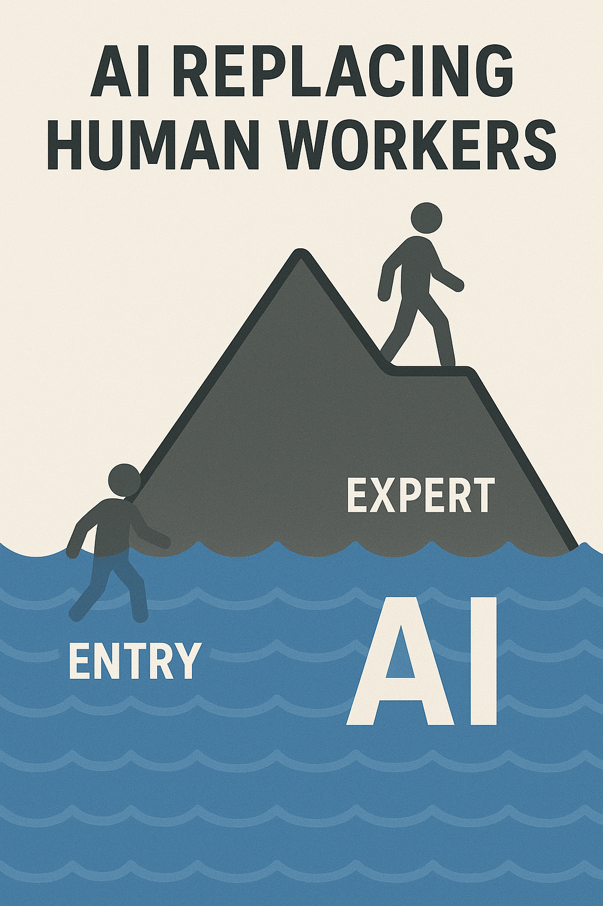

# How to Not Lose Your Job to AI

## The AI Displacement Crisis

Here are some hard truths:

1. The capabilities of AI & Robotics will continue to improve until they exceed all human capacities
2. Capitalism rewards automation and replacement -- what can be done cheaper will be done cheaper

This leaves the question, what can an individual do to secure their economic future in a world of rapidly improving technology and increasing inequality?

## The Water Level Paradigm

Individuals who are perceived to have higher value to employers are more insulated from AI displacement compared to their less-valuable counterparts.

We can imagine every profession as a mountain of eligible workers. Where you reside on that mountain is a reflection of how others perceive your value. The lowest value workers are at the bottom of the mountain, while the highest value workers are at the top.

Think of AI capabilities as a rising tide -- as AI improves it will flood the lower-value bottom of the mountain, while the higher-value top will remain dry.

The key is to grow your value and outpace the speed at which the water of AI is rising up the mountain.

### For Those Looking to Stay Above Water - Climb the mountain

**Network aggressively** - Human relationships are key in a world dominated by AI job applications and AI resume screens.

**Adopt a growth mindset** - Complacency is a recipe for replacement. Place a high value on learning and growth, but don't get tunnel-vision focusing on the "pure" skills related to your job. Dedicate significant time to high-leverage soft-skills like interviewing, managing expectations, and persuasion.

**Embrace using AI in your core competencies** - AI is a tool that can amplify your value, so adopting it can accelerate your growth. As a bonus, executives are likely to place a high-value on AI adoption, this makes being a leading adopter of AI a high-value trait

**Develop AI-complementary skills** - Lean into the parts of your role that AI can't do well - high-level strategy, people management, talking with customers, sales, etc. As AI makes some tasks easy, the relative value of an employee doing those tasks decreases. 

**Pursue higher ambiguity and longer-term responsibilities** - AI is worse at longer-term higher-ambiguity tasks. The higher-up you go in just about any profession, the more your role will be characterized by these sorts of tasks.

## Switching Mountains

Not all professions will be equally impacted by AI. For those who are early career and deciding on what skillset/profession to pursue, or for those who are looking to pivot their career, it's helpful to consider which "mountains" are a safer highground from the AI flood.

### **Where is AI-Lagging?**

**Physical world work** - Robotics is lagging behind LLM's in terms of capabilities. Plumbers, electricians, and other trades requiring physical presence and dexterity are less likely to be impacted in the near term.

**Hard to verify work** - AI training requires large datasets and easily verifiable results for tasks. Roles that have minimal data and are harder to verify will see AI capabilities lag behind other sectors.

Example: 
- High-risk - software engineering has a lot of data and is easy to verify (code compilationa and unit tests)
- Medium-risk - Writing novels is harder to verify, but has a lot of available data (books)
- Low-risk - Consulting is hard to verify and has minimal data

### **Protected Industries**

Industries that prevent AI from displacing workers are by definition *protected*.

- **Government and regulated sectors** - Slower to adopt, bureaucratic barriers
- **Unionized work** - Collective bargaining power means that workers are unlikely to be displaced until AI can perform the entire job function
- **Human-touch services** - Massage therapy, personal training, physical therapy, hospice care, etc.
- **Safety-critical roles** - Police, security, anything involving weapons will have a high regulatory barrier to full adoption

## Become a Capitalist - The Asset Acquisition Imperative

Here's the uncomfortable truth: AI + capitalism primarily benefits asset owners, not workers. Having enough assets where your passive income exceeds your expenses is the only true form of security in a world where AI will eventually erode the value of all human labor. 

**Acquire Assets**
- **Invest aggressively** - Every dollar not invested is losing the race against AI productivity gains, low-cost index funds will see terrific gains if AI productivity continues to improve.

**Go sell something**
- Businesses benefit from AI, so if you can start a business, even a simple one, you can use AI to your advantage. As a business, labor is a cost-center, so when AI automates labor, your profit margins increase. 

## Actionable Takeaways

You should feel empowered to develop your own takeaways, but here are some to get you started:

### 1. Start Paying Attention to the Water Level

Like the internet, AI isn't going away. Paying extra attention to how AI can be used in your field won't hurt you, but ignoring it will. Stop avoiding AI tools and start looking for ways to leverage AI in your current workflows to gain an advantage.

### 2. Commit to Action

- Dedicate X hours per week to AI learning and adaptation
- Set specific goals for skill development or career growth/pivoting

### 3. Increase Your Pace

Prioritize asset acquisition harder than you normally would through any or all of the following:
- Look for ways to increase your income
- Develop and/or tigthen your budget

Invest money saved through the above into assets like low-cost index funds (DYOR NFA).

## Related Sections
- [[growth-mindset]] - Essential for continuous adaptation
- [[values]] - Clarifying what matters when everything changes
- [[procrastination]] - Overcoming inaction in the face of change